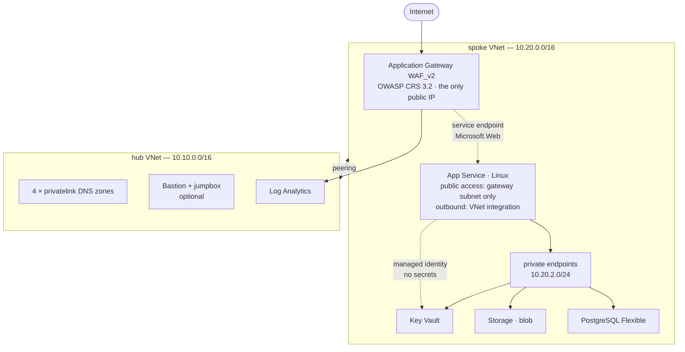

# Zero-Trust Web Platform on Azure — a Bicep lab

A hands-on lab that builds a production-shaped Azure platform entirely in Bicep, where the
web application has exactly one public entry point and every other component — database,
storage, secrets — is unreachable from the internet.

It is not a tutorial that ends with a green checkmark. Every control the architecture claims
comes with a command that tries to break it, and the chapter is only finished when the
attempt fails for the reason the design says it should.



---

## What you actually learn

**Azure**, by having to make it work rather than by reading about it:

| | |
|---|---|
| Hub-and-spoke networking | two VNets, peering in both directions, NSGs written out rule by rule |
| Private Link | six private endpoints, four private DNS zones, and why the zone is the part that matters |
| Application Gateway WAF v2 | OWASP CRS, Detection versus Prevention, exclusions, and reading the firewall log |
| Identity over secrets | managed identity, RBAC data-plane roles, Key Vault references, shared keys switched off |
| Azure Policy | three custom definitions, an initiative, and an assignment that denies a real deployment |
| Deployment stacks | lifecycle management, deny assignments, and a teardown that cannot leave anything behind |
| Log Analytics | resource-specific tables, the KQL that finds a blocked request, two alerts worth having |

**Bicep**, past the point where most examples stop:

- user-defined **types** with `@export()`, imported across every module — [`infra/types.bicep`](infra/types.bicep)
- user-defined **functions** encoding the naming convention — [`infra/naming.bicep`](infra/naming.bicep)
- **subscription-scope** orchestration that creates the resource groups it then fills
- **`.bicepparam`** with `using none`, `extends` for shared values, and `az.getSecret()` so a
  password reaches the deployment without ever touching the repository
- **`loadJsonContent()`** for policy rules, because `[parameters('effect')]` inside a Bicep
  string does not survive compilation
- **offline assertions** — `bicep test` running real checks with no subscription attached
- a `bicepconfig.json` whose linter rules are **errors**, not suggestions

---

## Prerequisites

- An Azure subscription where you are **Owner** — role assignments and policy definitions
  are not available to Contributor
- Azure CLI 2.60 or newer, and the Bicep CLI: `az bicep install`
- PowerShell 7 or bash
- About EUR 1 of Azure spend, and the discipline to run the teardown afterwards

---

## Quickstart

```bash
az login && az account set --subscription "<your-subscription>"
```

```bash
./scripts/bootstrap.ps1 -Environment dev
```

The bootstrap prints three values. Paste them into
[`infra/main.dev.bicepparam`](infra/main.dev.bicepparam), then:

```bash
./scripts/deploy.ps1 -Environment dev
```

```bash
./scripts/verify.ps1 -Environment dev
```

```bash
./scripts/teardown.ps1 -Environment dev
```

`bash` equivalents of all four live beside them in [`scripts/`](scripts).

> **The workflows do not deploy anything until you set them up.** `Deploy` and `Destroy` are
> manual-trigger only, and CI's what-if job skips itself while the Azure secrets are absent —
> so a fresh clone is green and costs nothing. [Chapter 09](docs/09-cicd-oidc.md) turns them on.

---

## Cost

Application Gateway WAF_v2 is the expensive component: roughly **USD 0.44 per hour** in
fixed cost before any traffic, which is around USD 320 a month if it is left running. The
lab is designed to be deployed, verified and destroyed in one sitting.

| Component | ~USD/hour | Note |
|---|---|---|
| Application Gateway WAF_v2 | 0.44 + capacity units | teardown is not optional |
| App Service B1 | 0.018 | `P1v3` only in the prod profile |
| PostgreSQL Flexible B1ms | 0.017 | burstable, 32 GB |
| Private endpoints × 6 | 0.06 | USD 0.01 each |
| Azure Bastion Basic | 0.19 | off by default |
| Key Vault, Storage, Log Analytics | ~0 | per-use, negligible at lab volume |

**A full run: about USD 0.60–1.50.** Set a budget alert before you start —
[`docs/cost-and-cleanup.md`](docs/cost-and-cleanup.md) shows how, and how to prove nothing
survived the teardown.

---

## The chapters

| | | |
|---|---|---|
| 00 | [Architecture](docs/00-architecture.md) | the threat model, and every design decision with the alternative it beat |
| 01 | [Toolchain](docs/01-toolchain.md) | CLI versions, providers, the naming convention, the bootstrap vault |
| 02 | [Network](docs/02-network.md) | hub, spoke, peering, NSGs, private DNS |
| 03 | [Platform services](docs/03-platform-services.md) | Key Vault, Storage, PostgreSQL — all six private endpoints |
| 04 | [Compute](docs/04-compute.md) | App Service, VNet integration, managed identity, Key Vault references |
| 05 | [Edge and WAF](docs/05-edge-waf.md) | Application Gateway, OWASP rules, Detection → Prevention |
| 06 | [Observability](docs/06-observability.md) | diagnostic settings, the KQL that matters, two alerts |
| 07 | [Governance](docs/07-governance.md) | custom policy, an initiative, and watching Deny actually deny |
| 08 | [Deployment stacks](docs/08-deployment-stacks.md) | lifecycle, deny assignments, tampering with it from the portal |
| 09 | [CI/CD with OIDC](docs/09-cicd-oidc.md) | federated credentials, what-if on a pull request, PSRule |
| 10 | [Verification](docs/10-verification.md) | the proof matrix — every claim, its command, its expected output |
| 11 | [Testing Bicep](docs/11-testing.md) | offline assertions, and the bug they caught in this repository |
| 12 | [Azure Verified Modules](docs/12-avm.md) | swap a hand-written module for the Microsoft-maintained one |
| — | [Troubleshooting](docs/troubleshooting.md) | the errors this build actually produces, and what they mean |
| — | [Cost and cleanup](docs/cost-and-cleanup.md) | budget alerts, teardown, and proving it worked |

---

## Repository layout

```
infra/
  main.bicep                    subscription scope: three resource groups, then modules
  bootstrap.bicep               phase zero: the vault holding the database password
  types.bicep                   exported type contracts
  naming.bicep                  exported naming functions
  main.shared.bicepparam        values dev and prod both use
  main.dev.bicepparam           cheap profile — what the lab runs
  main.prod.bicepparam          the same platform without the cost compromises
  bicepconfig.json              linter rules raised to error
  modules/
    network/     hub, spoke, peering, NSGs, private DNS, Bastion, jumpbox
    platform/    Key Vault, Storage, PostgreSQL, bootstrap vault
    app/         App Service plan and site
    edge/        WAF policy, Application Gateway
    observability/  Log Analytics, alerts
    governance/  policy definitions (+ rules as JSON), assignment
    shared/      private endpoint, RBAC
  tests/         offline assertions
.github/workflows/   ci (build, lint, test, PSRule, what-if) · deploy · destroy
scripts/             bootstrap · deploy · verify · teardown · validate
.ps-rule/            PSRule for Azure configuration
```

---

## Before you commit anything

```bash
./scripts/validate.ps1
```

Compiles every template and parameter file, lints them against the elevated rules, and runs
the offline assertions. No subscription, no login, no cost.

---

## License

MIT — see [LICENSE](LICENSE).
