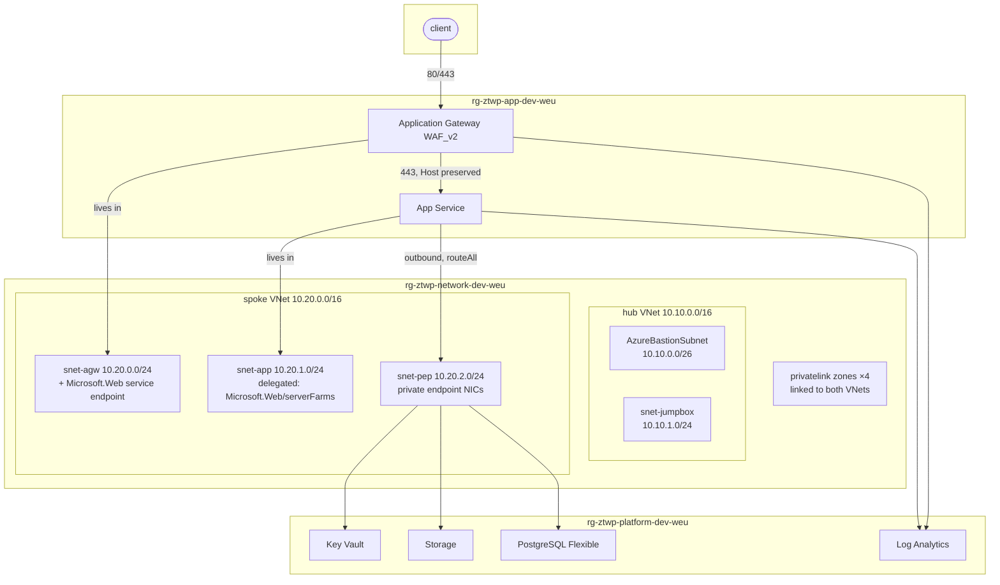

# 00 — Architecture

> What is being built, what it is defending against, and which alternatives were rejected
> on the way. Read this before running anything; every later chapter assumes the decisions
> made here.

---

## The problem statement

A web application with a database, object storage and secrets. Ordinary. The question the
platform has to answer is not "does it run" but:

1. How does traffic arrive, and what inspects it before the application does?
2. What can reach the database — and what can prove that nothing else can?
3. Where do credentials live, and who ever sees them?
4. When something is blocked, where does that show up?
5. When someone changes a setting in the portal at 23:00, what stops them?

Each question maps to a chapter. Each answer is a resource in Bicep, and each is verified
in [chapter 10](10-verification.md) rather than asserted.

---

## Threat model

Not an exhaustive one — a lab-sized one, honest about what it does and does not cover.

| Threat | Control in this platform | Chapter |
|---|---|---|
| Automated scanning and injection against the public endpoint | Application Gateway WAF v2, OWASP CRS 3.2 in Prevention | [05](05-edge-waf.md) |
| Bypassing the WAF by hitting the app's own hostname | Access restriction pinned to the gateway subnet; private endpoint in the prod profile | [04](04-compute.md) |
| Data exfiltration from storage using a leaked account key | `allowSharedKeyAccess: false` — there is no key | [03](03-platform-services.md) |
| Database reachable from the internet | `publicNetworkAccess: Disabled`, private endpoint only | [03](03-platform-services.md) |
| Secrets in source control, CI logs or app settings | Bootstrap vault + `az.getSecret` + Key Vault references + OIDC | [01](01-toolchain.md), [09](09-cicd-oidc.md) |
| A "private" service that still resolves to a public IP | Private DNS zones linked to both VNets | [02](02-network.md) |
| Configuration drift and portal edits | Deployment stack with `denyWriteAndDelete` | [08](08-deployment-stacks.md) |
| A future deployment quietly re-opening public access | Azure Policy initiative with a Deny effect | [07](07-governance.md) |

**Out of scope, and worth saying so:** DDoS protection (the Standard plan is USD ~3,000 a
month), Azure Firewall for egress filtering, multi-region failover, customer-managed
encryption keys, and Defender for Cloud. Each is a real control; none of them fit in a lab
that has to cost about a euro.

---

## The topology

Three resource groups, drawn along **lifecycle** lines rather than by resource type:

| Group | Holds | Why together |
|---|---|---|
| `rg-ztwp-network-*` | VNets, peerings, NSGs, private DNS, Bastion | changes rarely; owned by whoever owns addressing |
| `rg-ztwp-platform-*` | Key Vault, Storage, PostgreSQL, Log Analytics | stateful; deleting these loses data |
| `rg-ztwp-app-*` | App Service plan and site, WAF policy, gateway | redeployed most often; stateless |

If the application group is deleted and rebuilt, nothing of value is lost. That property is
the reason for the split, and it is worth more than tidiness.

---

## Decisions, and what they beat

### Application Gateway, not Front Door

Front Door Standard is cheaper and global. Its Premium tier is what supports Private Link
origins — at roughly USD 330 a month, and even then the origin is reachable through
Microsoft's edge rather than through your own VNet. Application Gateway sits *inside* the
spoke, which is what allows the backend to be resolved through the private DNS zone. The
lab is about VNet-internal routing, so the gateway wins.

### Private endpoint for PostgreSQL, not VNet injection

Flexible Server offers both, and they are mutually exclusive. VNet injection binds the
server to one delegated subnet in one VNet for its entire life. A private endpoint is the
same model as every other service here and can be extended to a second VNet later. The cost
is one more endpoint, about USD 0.01 an hour.

### An access restriction in dev, a private endpoint in prod

The most interesting trade-off in the platform, and the reason the two parameter files
differ:

| | dev profile | prod profile |
|---|---|---|
| `publicNetworkAccess` | Enabled | Disabled |
| Inbound path | public endpoint, access restriction allows only `snet-agw` | private endpoint in `snet-pep` |
| Failed request from elsewhere | `403 Ip Forbidden` | connection refused / NXDOMAIN |
| Kudu (SCM) console | reachable from the operator IP | **not reachable from the internet at all** |

The second column is stricter and takes the deployment and debugging surface off the
internet with it. That is correct for production and hostile to a lab, where the Kudu
console is the cheapest way to prove that private DNS resolution works from inside the VNet
without paying for a Bastion host. Chapter 04 has you run both.

### Kudu instead of a jumpbox

Verifying private DNS requires a shell inside the VNet. The obvious answer is a jumpbox and
Azure Bastion — about USD 0.19 an hour for Bastion Basic, plus the VM. The Bastion Developer
SKU is free but cannot traverse VNet peering, which makes it useless in a hub-and-spoke.

The App Service SSH console already runs inside the integrated subnet and ships with
`nameresolver`, `tcpping` and `curl`. It costs nothing and proves the same thing. Bastion
and the jumpbox stay in the repository as optional modules —
[`modules/network/bastion.bicep`](../infra/modules/network/bastion.bicep),
[`modules/network/jumpbox.bicep`](../infra/modules/network/jumpbox.bicep) — because the prod
profile genuinely needs them.

### Custom policy definitions, not built-ins

Built-in policies are referenced by GUID. A reviewer cannot tell what
`/providers/Microsoft.Authorization/policyDefinitions/404c3081-a854-4457-ae30-26a93ef643f9`
does without looking it up, and a template full of them is unreadable.

There is also a technical reason. The Key Vault in this platform deliberately keeps
`publicNetworkAccess: Enabled` and relies on `networkAcls.defaultAction: Deny`, because the
ARM resource provider must be able to write secrets into a vault it has just created. A
built-in policy demanding `publicNetworkAccess: Disabled` would reject the very platform it
was assigned to protect. The custom definition in
[`policy-rules/deny-public-network-access.json`](../infra/modules/governance/policy-rules/deny-public-network-access.json)
encodes the distinction.

### Hand-written modules, with one AVM chapter

Azure Verified Modules are the right default for production: Microsoft maintains them, they
are tested, and they carry far more surface than anything written in an afternoon. They are
the wrong default for a lab, because the interesting parts happen inside them.

[Chapter 12](12-avm.md) replaces one hand-written module with its AVM equivalent and diffs
the result, so the trade-off is visible rather than argued.

---

## What "zero trust" means here concretely

The phrase is worn out, so here is the operational version. Five properties, each provable
with one command in [chapter 10](10-verification.md):

1. **One public IP.** The gateway. Everything else answers only on RFC 1918 addresses.
2. **No shared secrets between components.** The app authenticates to Key Vault and Storage
   as itself; the pipeline authenticates to Azure with a federated token.
3. **No account keys.** `allowSharedKeyAccess: false` removes the credential rather than
   protecting it.
4. **Deny by default.** NSGs, storage network ACLs, Key Vault ACLs and App Service access
   restrictions all default to deny and allow a named exception.
5. **Changes have exactly one route in.** The deployment stack denies portal writes; the
   policy assignment denies non-compliant deployments.

---

Next: [01 — Toolchain and bootstrap](01-toolchain.md)
